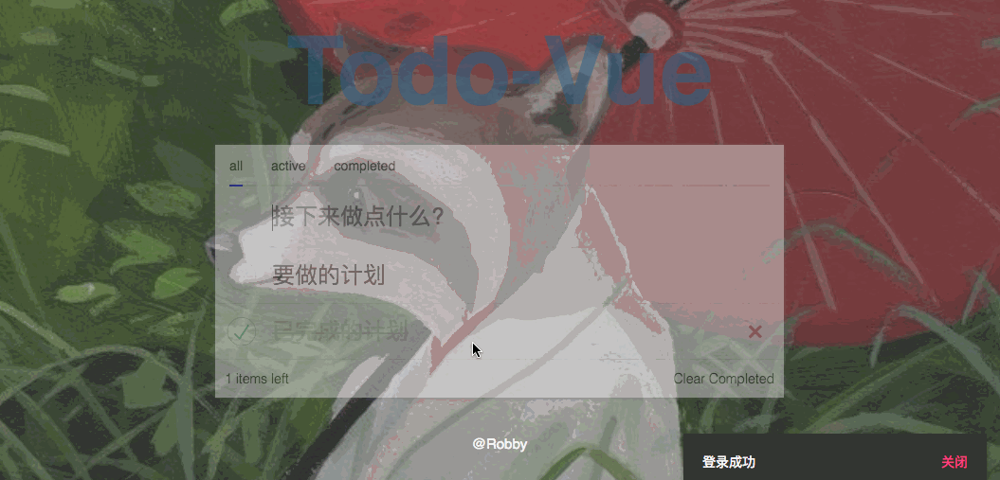

# Todo-Vue
## 运行
```
  yarn build
  yarn start
```

## 实现
+ vue + vuex + vue-router + vue-SSR
+ 利用业务逻辑较精简的Todo APP体验服务端渲染
+ 增加了对搜索引擎和爬虫的友好度
+ 首屏数据复用, 提高首屏加载速度

## 项目结构
```
.
├── Readme.md
├── app.config.js
├── build  # webpack相关
│   ├── template.html
│   ├── vue-loader.config.js
│   ├── webpack.config.base.js   # 通用config
│   ├── webpack.config.client.js # client端config
│   └── webpack.config.server.js # server端config
├── client
│   ├── app.vue
│   ├── assets
│   │   ├── images
│   │   │   ├── 1.jpg
│   │   │   ├── done.svg
│   │   │   └── round.svg
│   │   └── styles
│   │       ├── footer.styl
│   │       ├── global.styl
│   │       ├── test.css
│   │       └── test.stylus.styl
│   ├── client-entry.js # 仅运行于浏览器
│   ├── components
│   │   ├── loading # loading组件
│   │   │   └── loading.vue
│   │   ├── notification # 通知插件
│   │   │   ├── func-notification.js
│   │   │   ├── function.js
│   │   │   ├── index.js
│   │   │   └── notification.vue
│   │   └── tabs # filter组件
│   │       ├── index.js
│   │       ├── tab-container.vue
│   │       ├── tab.vue
│   │       └── tabs.vue
│   ├── config # 路由设置
│   │   ├── router.js
│   │   └── routes.js
│   ├── create-app.js
│   ├── index.js # 通用 entry(universal entry)
│   ├── layout
│   │   ├── footer.jsx
│   │   └── header.vue
│   ├── model
│   │   ├── client-model.js
│   │   ├── server-model.js
│   │   └── util.js
│   ├── server-entry.js # 仅运行于服务器
│   ├── store
│   │   ├── actions
│   │   │   └── actions.js
│   │   ├── getters
│   │   │   └── getters.js
│   │   ├── mutations
│   │   │   └── mutations.js
│   │   ├── state
│   │   │   └── state.js
│   │   └── store.js
│   ├── util
│   │   └── bus.js
│   └── views
│       ├── login # 登录
│       │   └── login.vue
│       └── todo  # Todo
│           ├── helper.vue
│           ├── item.vue
│           └── todo.vue
├── favicon.ico
├── package.json
├── pm2.yml
├── postcss.config.js
├── server
│   ├── db #
│   │   └── db.js
│   ├── routes
│   │   ├── api.js # CRUD接口
│   │   ├── dev-ssr-no-bundle.js # 优化
│   │   ├── dev-ssr.js
│   │   ├── server-render-no-bundle.js
│   │   ├── server-render.js
│   │   ├── ssr-no-bundle.js # 采用createRenderer生成renderer
│   │   ├── ssr.js # 采用createBundleRenderer生成renderer
│   │   ├── static.js # 静态资源接口
│   │   └── user.js # login接口
│   ├── server.js
│   └── server.template.ejs # SSR模板
└── yarn.lock
```

## Demo

